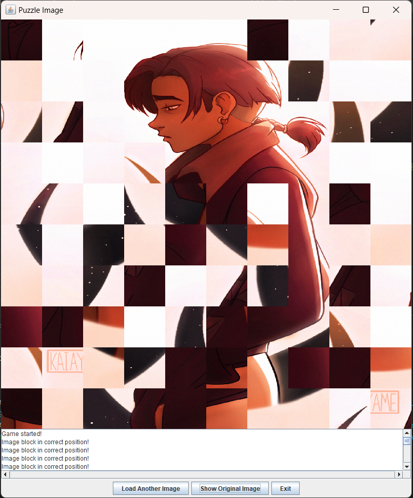

# Java Puzzle
This is a simple Java program to turn any image into a **puzzle** game.
The program converts an image into a 10x10 puzzle, it then scrambles
the pieces randomly. You can then drag and drop the pieces around, a
piece will lock into place once it is placed in the correct position.
You win the game once all the pieces are in their original position.

Steps to play:
1. Run the *JavaPuzzle.java* program
2. Select an image from your folder
3. Drag and drop the pieces into their original places
(Hint: Use the feature to view the original image if you are lost)
   
